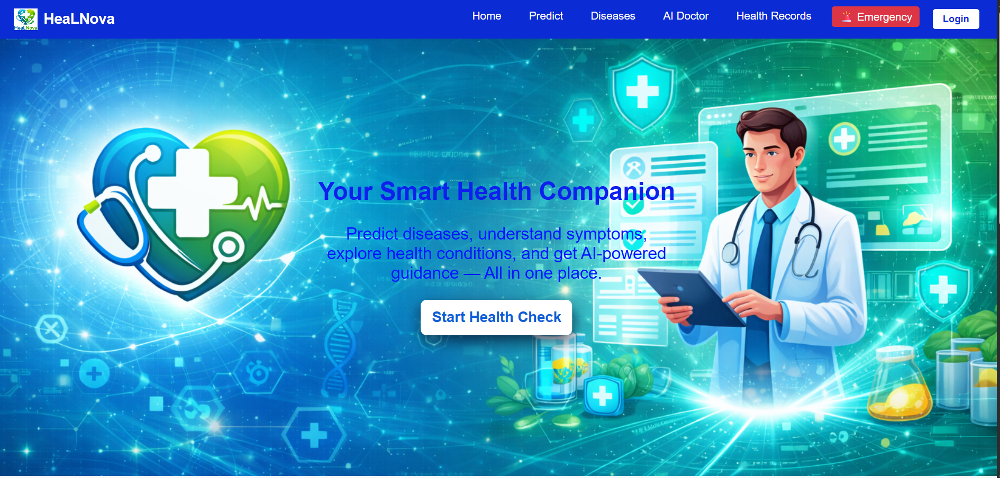
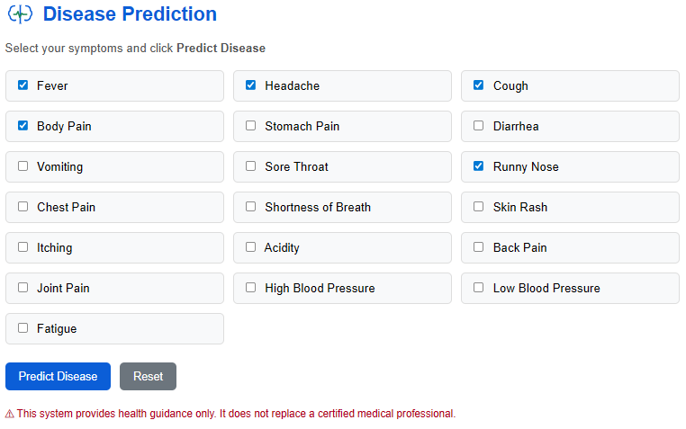
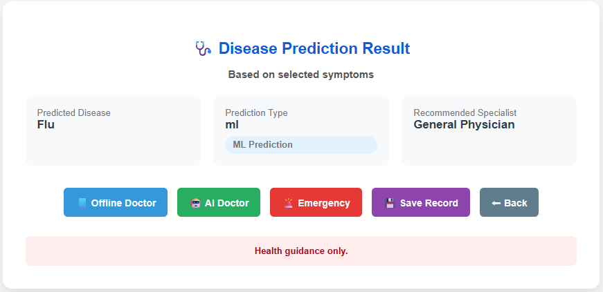
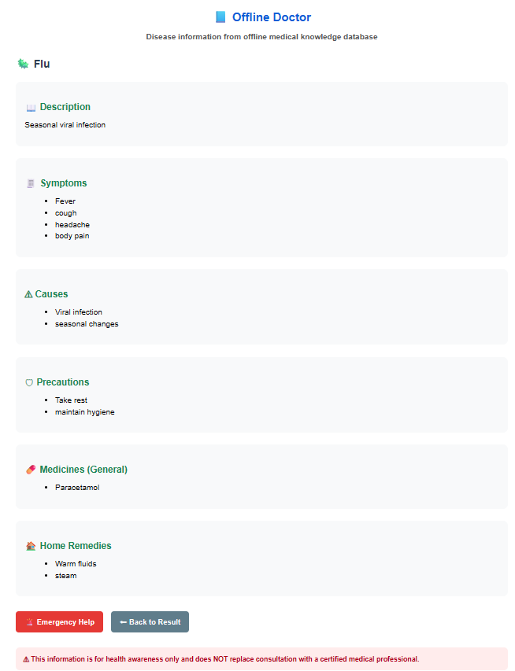
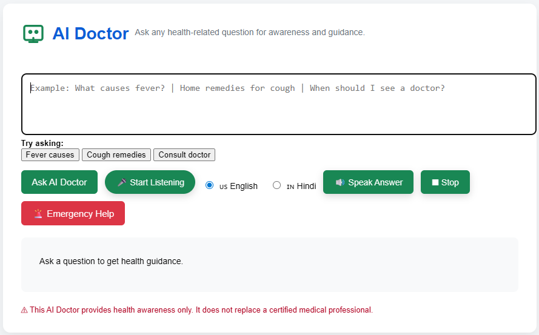
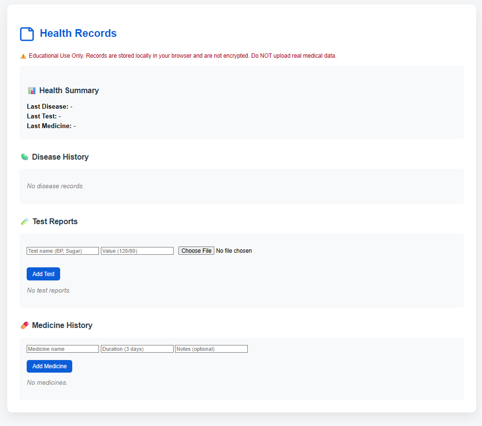
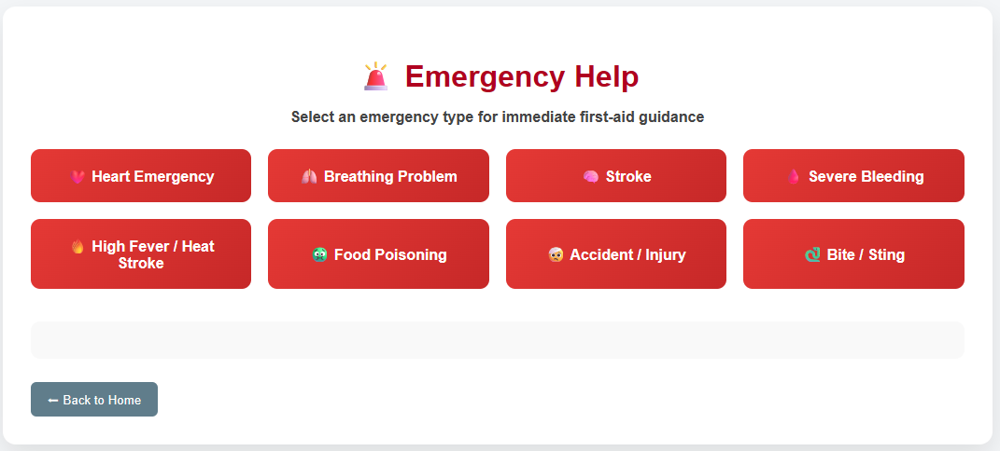

#  <h1>
  
  <span style="font-size: 50px; vertical-align: middle;">HealNova</span>
  </h1>

> **AI-Powered Hybrid Smart Health Assistant**  
> Built with Flask + Gemini AI + Machine Learning + Modern Web UI  

HeaLNova is an intelligent **Hybrid Healthcare Web Application** that provides:

-  Disease Prediction (Machine Learning + Rule-based hybrid)
-  AI Doctor (Gemini-powered)
-  Voice Interaction
-  Hindi Translation Support
-  Disease Explorer
-  Smart Health Records (User-scoped)
-  Login System
-  Emergency Guidance


It works in **both Online and Offline modes**, making it usable even in low-network environments.

 This project is for educational purposes only.  
It does NOT replace professional medical advice.

---

#  Hybrid Mode (Online + Offline Support)

HeaLNova is designed as a **Hybrid Healthcare System**.

##  Offline Mode (No Internet Required)

- Disease Prediction (ML model runs locally)
- Offline Doctor (CSV-based disease database)
- Disease Explorer
- Health Records
- Emergency Guidance
- Login System

##  Online Mode (Internet Required)

- AI Doctor (Gemini AI)
- Hindi Translation
- AI-based health explanations
- Voice assistant enhancements

This makes HeaLNova usable even in rural or low-network environments.

---

#  Screenshots

##  Home Page


##  Disease Prediction


##  Prediction Result


##  Offline Doctor


##  AI Doctor


##  Health Records


## Emergency Guidance


---

#  Features (Detailed)

---

##  1. Disease Prediction System (ML + Rule Hybrid)

- Select symptoms from structured grid
- Handles:
  - Single symptom (safe rule validation)
  - ML prediction
  - Overlapping disease logic
- Shows:
  - Predicted disease
  - Prediction type (ML / Rule / Overlap)
  - Recommended specialist
- Save prediction to Health Records

   Powered by:
   - Trained ML model (.pkl)
   - Rule-based safety logic
   - Flask backend API

---

##  2. Offline Doctor (Works Without Internet)

- Uses local CSV-based disease database
- No AI required
- Provides:
  - Description
  - Symptoms
  - Causes
  - Treatment guidance
  - Prevention tips
- Perfect for low-connectivity environments

---

##  3. AI Doctor (Gemini AI Powered)

- Ask any health-related question
- Context-aware if coming from prediction result
- Backend powered by Google Gemini API
- Provides:
  - Causes
  - Precautions
  - When to consult doctor
  - General health awareness
- Safety rule:
  - No medicine dosage advice

---

##  4. Voice Assistant System

###  Voice Input (Speech → Text)
- Click mic button to start listening
- Animated glow while listening
- Click again to stop
- Uses Web Speech API

###  Voice Output (Text → Speech)
- Click “Speak Answer”
- Optional Hindi voice toggle
- Stop button available
- Manual control (no auto speaking)

---

##  5. Hindi Translation Support

- Toggle Hindi mode
- Backend translates AI reply
- Hindi voice speaks translated content
- Useful for regional accessibility

---

##  6. Disease Explorer

- Search diseases
- Filter by category
- View:
  - Description
  - Symptoms
  - Causes
  - Medicines
  - Remedies
- Works completely offline (CSV data)

---

##  7. Smart Health Records

User-specific storage system:

- Disease history
- Test reports (Image / PDF)
- Medicine history
- Health summary dashboard

Login required to access.

Storage system:
- Stored in browser localStorage
- Scoped per user email

 Not encrypted (Educational prototype)

---

##  8. Emergency Guidance System

HeaLNova includes a dedicated **Emergency Assistance Module** designed for critical health situations.

### Emergency Page Features

- Instant emergency instructions
- Basic first-aid awareness
- Clear action steps
- Emergency hotline display

###  Important

This feature provides **awareness guidance only** and encourages users to:
- Contact local emergency services
- Visit nearest hospital immediately

---

##  9. Authentication System

- Local signup/login system
- User-based record isolation
- Navbar account dropdown
- Logout functionality
- Access protection for Health Records

---

#  System Architecture

## Frontend
- HTML5
- CSS3
- JavaScript
- LocalStorage
- Web Speech API

## Backend
- Python Flask
- Google Gemini API
- Pandas (CSV handling)
- Machine Learning model (joblib)

## Storage
- CSV-based disease data (Offline)
- localStorage (User-scoped records)

---

##  Project Structure

```
HealNova-AI-Health-Assistant/
│
├── Backend/
│   ├── app.py
│   ├── requirements.txt
│   ├── users.json
│   ├── ML/
│   │   ├── model.pkl
│   │   ├── ml_predict.py
│   │   ├── train_model.py
│   │   ├── disease_info.csv
│   │   └── symptoms_dataset.csv
│   └── utils/
│       └── ai_gemini.py
│
├── Frontend/
│   ├── index.html
│   ├── disease_predict.html
│   ├── result.html
│   ├── ai_doctor.html
│   ├── disease_explorer.html
│   ├── disease_info.html
│   ├── health_records.html
│   ├── emergency.html
│   ├── login.html
│   ├── signup.html
│   ├── navbar.html
│   ├── footer.html
│   ├── about.html
│   ├── contact.html
│   ├── privacy.html
│   ├── terms.html
│   │
│   ├── CSS/
│   │   └── style.css
│   │
│   ├── JS/
│   │   ├── main.js
│   │   ├── ui.js
│   │   └── voice.js
│   │
│   └── images/
│       ├── healnova-logo.png
│       ├── favicon.png
│       ├── hero-bg.png
│       └── icons/
│
├── docs/
│   └── screenshots/
│       ├── home.png
│       ├── prediction.png
│       ├── result.png
│       ├── ai-doctor.png
│       ├── records.png
│       ├── emergency.png
│       └── offline-doctor.png
│
├── .gitignore
├── LICENSE
└── README.md
```

---

##   Check Live 

Open `https://healnova-ai.netlify.app`

---

#  Security Notes

- Records stored in browser localStorage
- Not encrypted
- Not suitable for real medical data
- Educational prototype only

---

#  Problem Statement

Many people lack reliable healthcare guidance in rural or low-network regions.

HeaLNova solves this by combining:

- AI assistance
- Offline medical database
- Voice interaction
- Personal record tracking
- Hybrid architecture

into a single smart healthcare assistant.

---

#  Future Enhancements

- Database-based storage (MongoDB / MySQL)
- Encrypted medical records
- Doctor appointment booking
- Doctor–Patient chat
- PWA version
- Mobile App version
- Role-based system (Doctor / Patient)
- AI symptom chatbot before prediction

---

#  Developed By

**Sumit Sharma**  
B.Tech (CSE)  
AI + ML + Full Stack Developer  

---
